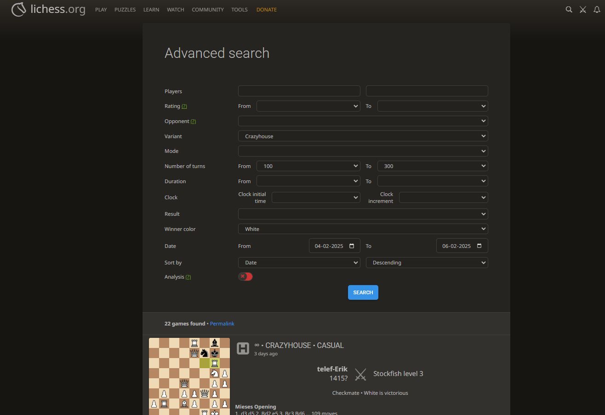
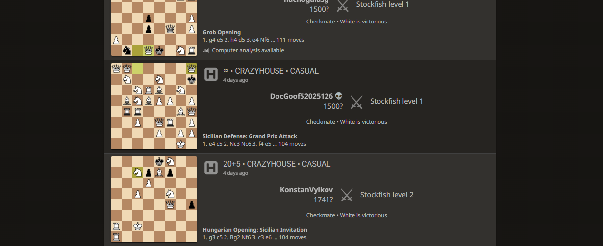

# LEAKY GAME

We were given a picture and a big challenge text. The words of the challenge text:

> "I just moved into this place, and my neighbor is... weird. A mad scientist—wild hair, crazy eyes, always muttering about 'the perfect game for my plan.' The other night, I saw a strange chessboard through his window, pieces arranged in a way that felt... wrong. The board was conquered by white and the game was weirdly verrry loong. But I think he's hiding something. Something big. Think of this and give me some clues."

As a *Phineas and Ferb* fan, I remembered something about Dr. Heinz Doofenshmirtz, and he looked exactly the same. Now I looked at the chess game—it wasn't a normal game. It had **9 pawns, 3 knights, and 3 same-colored bishops**.

## Step 1: Identifying the Chess Variant

This must be a chess variant! I concluded that this was **Crazyhouse**. The chessboard seemed to be from **Lichess**.

So, I used the **advanced search option in Lichess**, but I didn't know:
- The exact date the game was played.
- The time control used.

However, the challenge text mentioned that the game was *long*.

Also,as the challenge description said,that the "board was conquered by white",that meant the winner color was white.

For the date, I took the creation date of the given image: **5 February**. To avoid risks, I set the search date from **4–6 February** and time control from **1 hour to 3 hours**. I analyzed every game but didn't find anything.

Then I realized that a game can be "big" in **number of turns** as well.Then i tried setting the number of turns from 100 to 300. So I analyzed around 22 games:



Finally found a game played by an account:


[DocGoof52025126](https://lichess.org/@/DocGoof52025126)

His username resembled **Dr. Heinz Doofenshmirtz**.

In his last game, at **move 53**, he was in the same position as in the given PNG to us

## Step 2: Investigating the User

I analyzed all his **17 games** but found nothing. However, I noticed that he had **16 imported games**. Viewing the PGN of the top game, I found this:

```
[Event "TOP SECRET STUFF"]
[Site "https://lichess.org/p6TIg4qY"]
[Date "2025.02.04"]
[White "MasterBot1992"]
[Black "DrFeinzGoof4545"]
[Result "1-0"]
```

### Key Findings:
1. The **PGN files were edited**, and all **16 imported games** had different event names but no flag.
2. I now had **two related accounts**: `DocGoof52025126` and `DrFeinzGoof4545`.

## Step 3: Searching for the Accounts

I searched for these accounts on **every platform** possible. Finally, I found a **GitHub user** with the same ID:

[DrFeinzGoof4545](https://github.com/DrFeinzGoof4545)

He had a repository containing a **video** explaining how to store data in chess games:

[Deepest Secret Inator](https://github.com/DrFeinzGoof4545/deepest-secret-inator)

## Step 4: Extracting Hidden Data

I downloaded all necessary files and modified `decode.py` to extract the hidden data:

I also modified the decode.py a little for my ease
I entered **every PGN manually** and got these outputs with the EVENT id's:

```
�֪.@�-E�]��4x���L�r���y�h�#

{{[�{q�+{�c);�3+��C+q�C+��+)�CK�!{��{{kKs9[��#���C{�)��++#�    Iq;�+�+q+;Kq�y#+��K)C{�3������Ks9�CK�K�q EVENT 9

er. The car accelerates at a steady 10 mph,{BITSCTF{H0p3_y0u_h4d_A_gr8_J0urn3y_eheheheheheh!??_564A8E9D}} which may sound slow, but trust me, it's lightning fast in reverse. Just imagine th   EVENT 8

���ͽ��ѕ�䁍Ʌ�丁    �Ё�Ё���́�ٕ�����  EVENT 7

��ͅ�����ȸ�%Н́չ��������ѡ�����ԝٔ��ٕȁ͕����Q�����������%Ё���́���ɕٕ�͔��Ё�����ͅ�������������$����ܰ��Н� EVENT 6

[��H[�H�^]    ���\�[���Z[���]H��\���\�\����^K��^K[�H�ۉ��[Y] �H\ˈH�\��[�\�Y�Z[[��\�  EVENT 5

�����х�ѕ�����ѡ��ݕ�ѡ�ȸ�$�������������䁥Н   EVENT 4

@��@�@����\@�����X@�����~@���@���N�@   EVENT 3

�6���22�4������80��94���:7��)�2����3�7�80��94���40�2�<���2�2�:94��6����3�0�47�����2�0�862�84���$���9��6���12�:2�:40�9�7�2��7���:!:�$�24��2���,���5�7��$��2�12��;��22�4�3�60�2�<�;�<�:42��1��64�0��0��7�80�:9��;�2�<���7�6<�;���7�2 EVENT 2

�Wr6�ffVR6��F�v�F�R7G&VWB�F�W��fR EVENT 1

Hey, guess what? I just found this amaz EVENT 0

�����х�ѕ�����ѡ��ݕ�ѡ�ȸ�$�������������䁥Н DEFENITELYSECRETSTUFFHERE

@��@�@����\@�����X@�����~@���@���N�@ SCRTIDK

�6���22�4������80��94���:7��)�2����3�7�80��94���40�2�<���2�2�:94��6����3�0�47�����2�0�862�84���$���9��6���12�:2�:40�9�7�2��7���:!:�$�24��2���,���5�7��$��2�12��;��22�4�3�60�2�<�;�<�:42��1��64�0��0��7�80�:9��;�2�<���7�6<�;���7�2 SCRT 3

�Wr6�ffVR6��F�v�F�R7G&VWB�F�W��fR SCRT 2

Hey, guess what? I just found this amaz SCRT 1
```

## Conclusion

The **final flag** was:

```
BITSCTF{H0p3_y0u_h4d_A_gr8_J0urn3y_eheheheheheh!??_564A8E9D}
```

